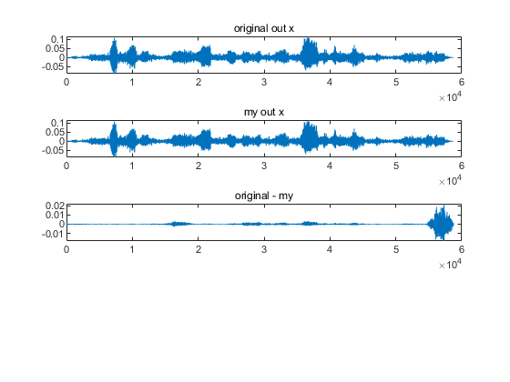

# A MATLAB implementation of CHiME4 baseline Beamformit

**Please let me know if there are any bugs.**

gogyzzz@gmail.com

## References

- "Acoustic beamforming for speaker diarization of meetings", Xavier Anguera, Chuck Wooters and Javier Hernando, IEEE Transactions on Audio, Speech and Language Processing, September 2007, volume 15, number 7, pp.2011-2023.
- [official beamformit github](https://github.com/xanguera/BeamformIt)

## Requirements

| script | requirement |
|---|---|
| beamformit.m | MATLAB supporting audioread (also you can use on OCTAVE by installing signal package) |
| beamformit_step_by_step.mlx | MATLAB supporting mlx format |

## Implementation detail
See beamformit_step_by_step\*.html (and beamformit_step_by_step.mlx)


## How to run

See beamformit.m 

## Result



```sh
## original version

local/chime4_calc_wers.sh exp/tri3b_tr05_multi_noisy beamformit_5mics exp/tri3b_tr05_multi_noisy/graph_tgpr_5k

-------------------
best overall dt05 WER 13.66% (language model weight = 11)
-------------------
dt05_simu WER: 14.34% (Average), 12.82% (BUS), 17.09% (CAFE), 11.90% (PEDESTRIAN), 15.56% (STREET)
-------------------
dt05_real WER: 12.98% (Average), 15.96% (BUS), 12.67% (CAFE), 10.02% (PEDESTRIAN), 13.26% (STREET)
-------------------
et05_simu WER: 21.33% (Average), 15.75% (BUS), 22.97% (CAFE), 22.54% (PEDESTRIAN), 24.06% (STREET)
-------------------
et05_real WER: 21.80% (Average), 30.08% (BUS), 20.62% (CAFE), 19.90% (PEDESTRIAN), 16.62% (STREET)
-------------------

## my version

local/chime4_calc_wers.sh exp/tri3b_tr05_multi_noisy bfit_1026_final exp/tri3b_tr05_multi_noisy/graph_tgpr_5k
compute dt05 WER for each location

-------------------
best overall dt05 WER 13.69% (language model weight = 11)
-------------------
dt05_simu WER: 14.31% (Average), 12.86% (BUS), 17.11% (CAFE), 11.90% (PEDESTRIAN), 15.37% (STREET)
-------------------
dt05_real WER: 13.07% (Average), 16.26% (BUS), 12.74% (CAFE), 9.84% (PEDESTRIAN), 13.45% (STREET)
-------------------
et05_simu WER: 21.85% (Average), 15.93% (BUS), 23.50% (CAFE), 23.44% (PEDESTRIAN), 24.52% (STREET)
-------------------
et05_real WER: 22.16% (Average), 30.72% (BUS), 20.88% (CAFE), 20.20% (PEDESTRIAN), 16.87% (STREET)
-------------------
```
